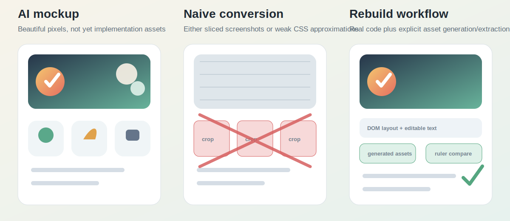

<div align="center">

# PNG To Frontend Rebuild

**把 AI 设计出来的 UI 截图，重建成真正可维护的前端代码。**

[English](README.md) | 简体中文

</div>

现在 GPT 这类模型已经能设计出非常漂亮的 UI：复杂背景、定制图标、会员徽章、产品场景、柔光、玻璃质感、插画控件，看起来很接近成品。

问题出在落地阶段。你把截图直接抠出来，放进前端工具里，它就只是死图；你完全用 CSS 硬写，又很容易丢掉原图里的复杂视觉效果。最后页面能跑，但质感和原设计差很远。

`png-to-frontend-rebuild` 就是为这个缝隙做的 Codex skill。它让 Codex 把 PNG/JPG/WEBP 设计图当成一次真正的前端重建任务：先识别复杂视觉资产，能用代码写的写成 DOM/组件，不能靠 CSS 准确还原的就生成或提取成独立资产，最后用浏览器截图和标尺对比来校准。



## 它解决什么问题

截图转前端常见失败有两种：

- **直接切图。** 看起来可能接近，但文字、布局、状态、组件都不可维护。
- **全靠 CSS 近似。** 结构能改，但复杂图标、背景效果、装饰物、品牌质感都没了。

这个 skill 要走第三条路：真实前端代码 + 对复杂视觉资产的明确处理。

## 它会让 Codex 做什么

- 写代码前先规划，不直接开干。
- 把重要视觉资产列出来，不跳过难点。
- 对 CSS 难以准确还原的视觉元素，使用图像生成或素材提取。
- 普通 UI 仍然用可编辑的前端代码实现。
- 不把截图里裁出来的小图标冒充“重绘”。
- 默认不还原手机系统状态栏、电量栏、Home Indicator。
- 高保真交付前，用截图和标尺对比检查差距。

## 安装

克隆仓库，然后把 skill 文件夹复制到 Codex skills 目录：

```powershell
git clone https://github.com/lvdehao0099/png-to-frontend-rebuild.git
Copy-Item -Recurse .\png-to-frontend-rebuild\png-to-frontend-rebuild "$env:USERPROFILE\.codex\skills\png-to-frontend-rebuild"
```

复制后开启一个新的 Codex 会话即可使用。

## 使用

```text
使用 $png-to-frontend-rebuild，把这个截图重建成一个前端项目：
C:\path\to\mockup.png

要求高保真。不要切图冒充图标。复杂视觉元素要生成或提取成独立资产，并给我浏览器截图和对比图。
```

## 适合什么场景

- AI 生成的 App 或网页 UI 设计图。
- 落地页、仪表盘、移动端页面、产品页、后台工具。
- 图标、插画、背景、徽章、纹理、产品图很重要的设计。
- 需要最终代码可维护、可继续开发的重建任务。

## 不适合什么场景

- 一键 OCR 或普通截图切片。
- 未授权复制专有 logo、人物肖像、地图、二维码、真实商品图。
- 已经有 Figma 或原始素材时，替代正规的设计交付源文件。

## 仓库里有什么

- `SKILL.md`：Codex 使用的主流程。
- `references/`：资产规划、框架适配、校准和移动端重建规则。
- `scripts/make_ruler_compare.py`：生成源图和实现截图的对比图。
- `assets/html-template/`：一个很小的静态 HTML 起点。

## License

暂未选择开源协议。在正式添加 license 前，请按 source-available 项目理解。
